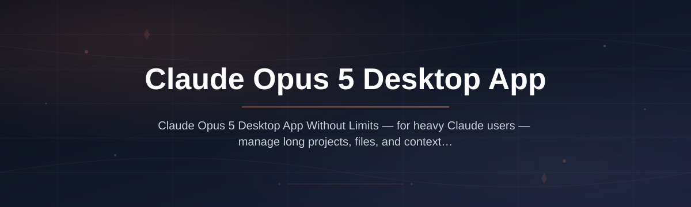
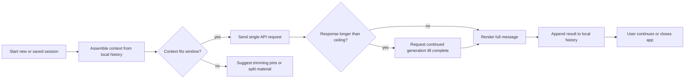

# claude-opus-5-desktop

  

*A standalone desktop client that keeps you in a continuous Claude Opus 5 session — with extended context, longer responses, and fewer interruptions than the web interface allows.*

---

## What this is

Claude Opus 5 Desktop App Without Limits is a Windows-native client for people who hit the ceiling of the browser chat: context windows that feel cramped, responses that stop mid-sentence, and sessions that reset just when you're making progress. This app gives you a persistent local workspace where the conversation stays open as long as you need it, and where longer model outputs are handled gracefully instead of being cut short.

The app wraps the latest Claude Opus 5 model family in a purpose-built desktop shell. You get a clean conversation panel, local history that never expires, and adjustable output settings that the web version simply doesn't expose. This project has no affiliation with Anthropic — it's an independent client that uses the standard API, built for people who want a no-limits workflow without living inside a browser tab.

  

The button above opens the official project page where you'll find the latest installer and release notes.

---

## Who it is for

- **Developers** who debug for hours in one session and need the full context to stay available without scrolling through a collapsed history.
- **Writers and analysts** working on long-form documents (reports, book chapters, technical specs) who need continuity across dozens of drafting messages.
- **Researchers** who paste large source materials and want to ask follow-up questions days later without re-uploading or losing the original framing.
- **Power users** of Claude who find the web interface's response limits break their flow when a thesis, a migration script, or a full code review runs long.

---

## What you can do

- **Run one persistent session** — close the app and reopen it later; your conversation, attachments, and message history are exactly where you left them.
- **Request extended responses** — toggle longer output ceilings for each conversation so your detailed analysis doesn't stop at the usual cutoff point.
- **Handle large paste jobs** — drop in disproportionately large text blocks (logs, transcripts, API docs) without the interface choking or truncating on input.
- **Switch models mid-chat** — move between Opus 5 and other Claude models in the same session when a lighter model is enough for the next step.
- **Export full threads** to Markdown or JSON — keep a clean record of your work for notes, git commits, or knowledge bases.
- **Pin important messages** to the top of the context summary so you and the model both stay anchored to key facts.
- **Organize projects into folders** — each folder holds its own sessions, so related work lives together rather than in one messy timeline.
- **Use keyboard-first navigation** — send, stop, edit, and search with shortcuts that don't require leaving the keyboard or navigating to tiny icons.

---

## Getting started

1. **Visit the landing page** — open [https://Embernyoretrieve.github.io/claude-opus-5-desktop/](https://Embernyoretrieve.github.io/claude-opus-5-desktop/) from any modern browser.
2. **Download the installer** — grab the latest `.exe` for Windows (10 or 11). There's no package manager setup, no dependency install, and no source build required.
3. **Run the installer and accept defaults** — installation takes about a minute and doesn't touch your existing Claude/OAI/AWS configuration.
4. **Launch the app and add your API key** — in "Settings → Account", paste your Anthropic API key (or use the OAuth flow if you're on a Claude plan).
5. **Start a new session** — pick a project folder, choose Claude Opus 5, and begin. That's it — no configuration file, no command line needed.

---

## Requirements

| Component | Minimum | Recommended |
|-----------|---------|-------------|
| **OS** | Windows 10 (64-bit, build 19041+) | Windows 11 |
| **RAM** | 4 GB available | 8 GB or more for large context loads |
| **Disk** | 500 MB free | 2 GB free (local history grows as you work) |
| **Display** | 1366×768 | 1920×1080 or higher |

The app is a standalone executable. It does **not** require an additional runtime, a Node.js install, or a Python toolchain. Internet access is only needed when messages are sent to Anthropic's API.

**First-run cost:** your conversation history and settings are stored locally under `%APPDATA%\claude-opus-5-desktop` as plain JSON — backup this folder if you need your sessions elsewhere.

---

## How it works

Claude Opus 5 Desktop App Without Limits is a local UI that manages your conversation snapshots and request formatting, then hands the traffic to the Claude API.

1. **Session persistence** — every message you send is appended to a local event log (JSON-LD). On startup, the app rebuilds the context array used for the API call from this log.
2. **Context management** — you choose what goes into the request: the full history, a conversation subset, or a custom set of pinned messages. Large contexts are sent without the app trimming the dialogue on you.
3. **Extended output request** — when you raise the response ceiling, the app loops service calls internally and stitches the parts together, presenting continuous output in a single bubble.
4. **Local processing only for logic** — the client computes context tokens via a local tokenizer (fast, offline-aware) to warn you before the API limit is reached, so you never get a silent rejection mid-stream.

Works on the current Claude models — use Claude Opus 5 for heavy reasoning and switch to lighter models (like Claude Haiku) for routing tasks. The API key is encrypted at rest using Windows DPAPI so it never hangs around as plaintext on disk.

---

## FAQ

**Q: Does "without limits" mean unlimited free API usage?**

No. "Without limits" refers to the desktop experience — no web-interface session timeouts, no hard-cap on one message's output from the UI, no compressed history that you can't scroll. The application works with your Anthropic API plan or key, and you pay standard API rates to the provider for tokens. All app features are free of charge — there is no hidden subscription inside.

**Q: How is this different from the Claude web app?**

The web app limits you to the context window set in the browser session and applies unlisted conversation constraints. This desktop client stores the full transcript locally, lets you rebuild context from any point in history, and removes output character caps that the interface enforces. To be clear, the underlying model context limit is a model property — the app simply doesn't impose its own stricter limit on top.

**Q: I only have a ChatGPT account — can I sign in here?**

No. This is a Claude desktop app specifically — you need Anthropic credentials (either their API or Claude subscription) or an enterprise Anthropic endpoint to use it.

**Q: Will my conversation history sync across two computers?**

If you carry the `%APPDATA%\claude-opus-5-desktop` folder between computers, the sessions load fine — they're self-contained. But there is no built-in cloud sync service, and note streaming sessions executed on one machine are stored only on that machine.

**Q: When I send a request, does it go straight to Anthropic, or through this project's server?**

Depends on your settings. The default config sends API calls directly from your machine to whatever endpoint you configure (`api.anthropic.com`, or a corporate proxy URL). If you specifically need to route through Anthropic's web-app gateway using OAuth (for subscription users), the ROUTING setting is toggled under Connection Mode. It does not go through any third-party server in this repository — there is none running here.

---

## Troubleshooting

**Stuck on "Loading session — please wait"**

First check we wrote your earlier sessions file — from Explorer, open `%APPDATA%\claude-opus-5-desktop\sessions\`; if that folder is present but visually empty, right-click the app and run as administrator; else, follow the backup path below.

**"API request failed: HTTP 401" after updating the app**

Your older encrypted API keys fail after token cycles. Re-enter your API key in Settings → Connection; DPAPI ties encryption to your Windows profile, so if your account is non-persistent you sometimes need to redo it after an OS update.

**Output stops mid-code even though I enabled Extended Responses**

Check the streaming proxy you set — add the header `accept: text/event-stream` if you're running a custom relay. For enterprise cookies, double-check the organization's token policy; several admins cap streaming SSE uses without returning any warning to the client.

**The UI is fine but Claude's response keeps getting "looped"/teleported — behavior looks wrong**

This happens when you pin an old message *after* training data refreshed, but you want it excluded. Select the relevant pin, click "Unpin for current context — keep only in log", then send a fresh empty turn to re-trigger the compose window for your follow-up.

---

## License

Released under the [MIT License](LICENSE) — the source code and compiled installer may be used for any purpose with attribution, provided the notice file stays intact.

**Disclaimer:** This project is an independent, unofficial client and is not affiliated with, endorsed by, or sponsored by Anthropic. "Claude Opus 5" is a trademark of Anthropic, used nominatively to describe compatibility. The vendor holds no responsibility for API behavior, rate limits, or content rules set by your usage tier. No warranty is granted, and you are responsible for complying with your provider's terms of service.

---

  

